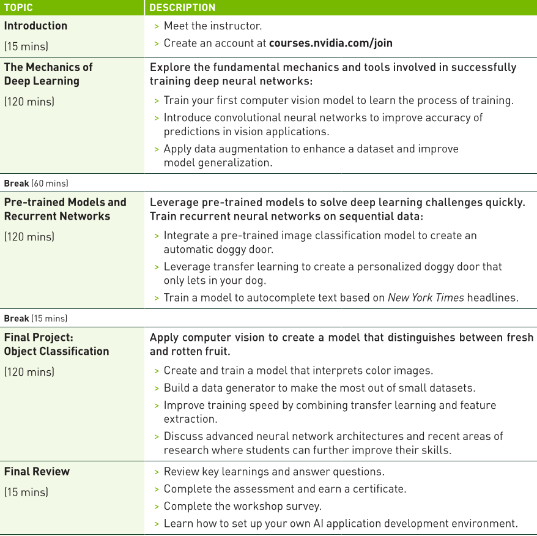
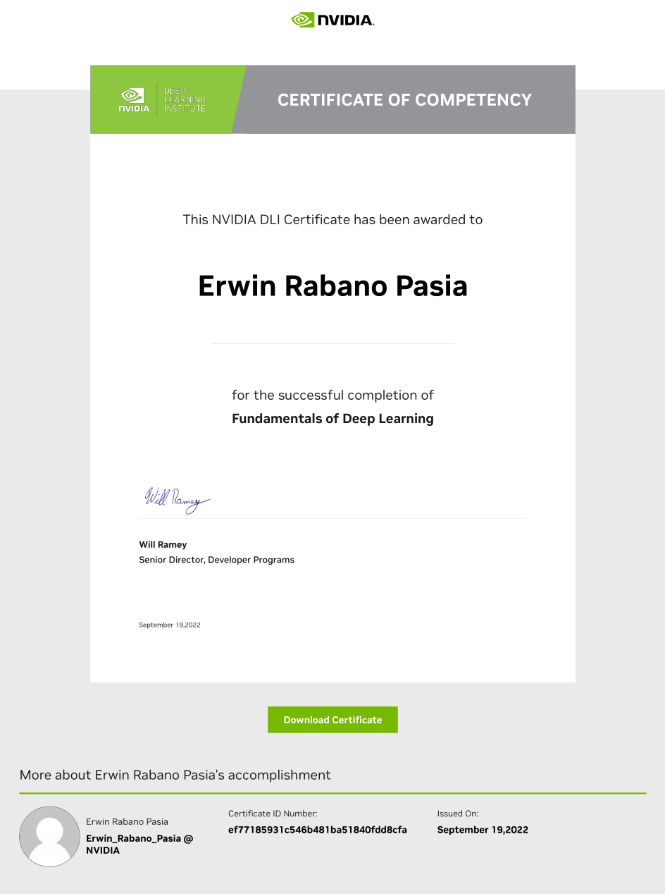

# [NVIDIA DLI - Advanced Technical Workshop: Fundamentals of Deep Learning](https://www.nvidia.com/en-us/training/instructor-led-workshops/fundamentals-of-deep-learning) - COMPLETED!

# Fundamentals of Deep Learning

This repository provides an overview of the **Fundamentals of Deep Learning** course, offered by NVIDIA's Deep Learning Institute (DLI). The course is designed to teach participants how deep learning works through practical, hands-on exercises in computer vision and natural language processing.

## Learning Objectives:
- Learn the fundamental techniques and tools required to train a deep learning model.
- Gain experience with common deep learning data types and model architectures.
- Enhance datasets through data augmentation to improve model accuracy.
- Leverage transfer learning between models to achieve efficient results with less data and computation.
- Build confidence to take on your own project with a modern deep learning framework.

## Topics Covered:
- PyTorch
- Convolutional Neural Networks (CNNs)
- Data Augmentation
- Transfer Learning
- Natural Language Processing

## Course Outline:

### **Introduction (30 mins)**
- Meet the instructor.
- Create an account at [courses.nvidia.com/join](https://courses.nvidia.com/join).
- Explore the fundamental mechanics and tools involved in successfully training deep neural networks.

### **The Mechanics of Deep Learning (3 hours)**
- Train your first computer vision model to learn the process of training.
- Introduce convolutional neural networks to improve accuracy in vision applications.
- Apply data augmentation to enhance datasets and improve model generalization.

### **Break (1 hour)**

### **Pre-trained Models and Large Language Models (1.5 hours)**
- Leverage pre-trained models to solve deep learning challenges quickly.
- Train recurrent neural networks on sequential data.
- Use a Large Language Model (LLM) to answer questions based on provided text.

### **Break (15 mins)**

### **Final Project: Object Classification (1 hour)**
- Apply computer vision to create a model that distinguishes between fresh and rotten fruit.
- Build a data generator to make the most out of small datasets.
- Improve training speed by combining transfer learning and feature extraction.

### **Final Review (30 mins)**
- Review key learnings and answer questions.
- Complete the assessment and earn a certificate.
- Learn how to set up your own AI application development environment.

## Overview of Deep Learning:

Deep learning is a powerful AI approach that uses multi-layered artificial neural networks to deliver state-of-the-art accuracy in tasks such as object detection, speech recognition, and language translation. Using deep learning, computers can learn and recognize patterns from complex data that are difficult for traditional software approaches.

## Key Tools in Deep Learning:
1. **PyTorch**: A popular deep learning framework used for building neural networks.
2. **CNNs**: Convolutional Neural Networks are widely used for image classification tasks.
3. **Transfer Learning**: A technique that allows you to leverage pre-trained models for faster development with smaller datasets.

## Benefits of Deep Learning:
Deep learning enables businesses across various industries, such as healthcare, retail, and automotive, to solve their most challenging problems by providing more accurate predictions, personalized experiences, and efficient operations.

## Instructor-Led Workshop Outline:

    

## [Certificate Of Competency:](https://learn.nvidia.com/certificates?id=ef77185931c546b481ba51840fdd8cfa)

    

